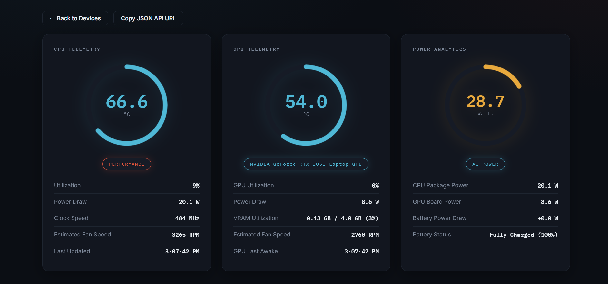

# SysVitals

SysVitals is a self-hosted system-monitoring dashboard. A small monitor program
runs on each computer you want to observe and sends CPU, GPU, battery, and
power-profile data to the SysVitals API. The dashboard then displays that data
from any browser.

## Dashboard telemetry



The dashboard groups the live readings into three panels:

- **CPU telemetry**: The gauge shows CPU temperature. **Utilization** is the
  percentage of CPU currently in use; **Power Draw** is CPU package power;
  **Clock Speed** is the current CPU frequency; **Estimated Fan Speed** is a
  temperature-based estimate; and **Last Updated** shows when the latest
  reading arrived. The chip identifies the active power profile.
- **GPU telemetry**: The gauge shows GPU temperature and the chip identifies
  the detected graphics card. **GPU Utilization** is its current workload;
  **Power Draw** is board power; **VRAM Utilization** compares used and total
  graphics memory; **Estimated Fan Speed** is temperature-based; and **GPU
  Last Awake** records the most recent successful GPU reading.
- **Power analytics**: The gauge shows the active system power estimate.
  **CPU Package Power** and **GPU Board Power** break out the two main
  contributors, while **Battery Power Draw** and **Battery Status** report the
  battery's charge/discharge state and percentage. The chip shows whether the
  device is on AC power or battery.

This guide deploys SysVitals **without Docker** on Ubuntu in WSL 2. It uses a
Cloudflare Tunnel to publish `https://status.example.com` securely. You
do **not** need a public IP address, router port-forwarding, Windows firewall
rules, or a TLS certificate on the WSL machine.

## What you will build

```text
Browser / monitor
        |
        | HTTPS
        v
Cloudflare
        |
        | outbound Cloudflare Tunnel connection
        v
Ubuntu on WSL
  cloudflared --> Caddy (127.0.0.1:8080)
                    |-- /        static dashboard files
                    `-- /api/*  FastAPI (127.0.0.1:8000)
                                   `-- SQLite database
```

Only `cloudflared` connects to the public internet. Caddy, FastAPI, and the
database remain private inside Ubuntu.

## Before you begin

You need:

- Windows 11 or a supported Windows 10 version with WSL 2 enabled.
- An Ubuntu WSL distribution with `systemd` enabled.
- A Cloudflare account that manages the domain you intend to use.
- Permission to create a Cloudflare Tunnel and a public hostname.
- A working outbound internet connection from Ubuntu.

You do **not** need Docker, Docker Desktop, a public server, a fixed home IP,
or inbound ports 80/443.

> Keep the WSL distribution and Windows machine running. If either is shut
> down, the tunnel disconnects and the website becomes unavailable.

## 1. Install and prepare Ubuntu WSL

Open **PowerShell as Administrator** and install Ubuntu if needed:

```powershell
wsl --install -d Ubuntu
```

Restart Windows if prompted. Then open **Ubuntu** from the Start menu and
create the Linux username and password it asks for.

### Enable systemd

SysVitals, Caddy, and Cloudflare Tunnel run as Linux services. Enable systemd
inside Ubuntu:

```bash
sudo tee /etc/wsl.conf >/dev/null <<'EOF'
[boot]
systemd=true
EOF
```

Close Ubuntu. Back in PowerShell, stop and restart WSL:

```powershell
wsl --shutdown
wsl -d Ubuntu
```

Back in Ubuntu, confirm systemd is available:

```bash
systemctl is-system-running
```

`running` is ideal. `degraded` can be normal on a fresh WSL installation as
long as the SysVitals services start successfully later.

### If Ubuntu will not start

Check registered distributions from PowerShell:

```powershell
wsl --list --verbose
```

If `wsl` says no distributions are installed but `wsl --install -d Ubuntu`
says Ubuntu already exists, launch `ubuntu.exe` once from PowerShell or the
Start menu to finish its initial registration. If that still fails, repair or
reinstall the Ubuntu app, then rerun the install command above.

## 2. Put the project in Ubuntu's Linux filesystem

Do not run the deployed app directly from `/mnt/c`; it is slower and can cause
Linux permission issues. Copy or clone the project under your Ubuntu home
directory instead.

If the checkout is currently at `C:\Projects\SysVitals`, run this in Ubuntu:

```bash
cp -a /mnt/c/Projects/SysVitals ~/SysVitals
cd ~/SysVitals
```

If you have a Git remote instead, clone it directly in Ubuntu:

```bash
sudo apt-get update && sudo apt-get install -y git
git clone <YOUR_REPOSITORY_URL> ~/SysVitals
cd ~/SysVitals
```

Confirm the installer exists:

```bash
ls deploy/wsl-native-deploy.sh
```

## 3. Install SysVitals as native Ubuntu services

Run the supplied installer from the project directory:

```bash
chmod +x deploy/wsl-native-deploy.sh
./deploy/wsl-native-deploy.sh
```

The script will ask for your Ubuntu password when it needs `sudo`. It installs
Caddy and Python dependencies, creates a dedicated `sysvitals` Linux account,
and enables these services:

| Service | Purpose | Listener |
| --- | --- | --- |
| `sysvitals-backend` | FastAPI API and SQLite access | `127.0.0.1:8000` |
| `caddy` | Dashboard files and same-origin `/api` proxy | `127.0.0.1:8080` |

It stores the deployed application in `/opt/sysvitals` and the persistent
database in `/var/lib/sysvitals/sysvitals.db`. The database is not deleted by
future application updates.

Check that both services are working before setting up Cloudflare:

```bash
systemctl status sysvitals-backend caddy --no-pager
curl -fsS http://127.0.0.1:8000/health
curl -fsS http://127.0.0.1:8080/health
```

Both `curl` commands should print:

```json
{"status":"ok"}
```

### Python 3.14 installation error

Ubuntu 26.04 uses Python 3.14. If installation stops while building
`pydantic-core` and reports `linker cc not found`, update your checkout to the
current version of this project and rerun the installer. The current dependency
set uses a Pydantic release with Python 3.14 wheels, so no Rust compiler or C
build toolchain is required:

```bash
cd ~/SysVitals
git pull --ff-only
./deploy/wsl-native-deploy.sh
```

If this checkout does not have a Git remote, edit
`backend/requirements.txt`, changing `pydantic==2.9.2` to
`pydantic==2.13.4`, then rerun the installer.

## 4. Create the Cloudflare Tunnel

1. Sign in to the [Cloudflare Zero Trust dashboard](https://one.dash.cloudflare.com/).
2. Select your account, then open **Networks > Tunnels**.
3. Select **Create a tunnel**.
4. Choose **Cloudflared**, name it `sysvitals-wsl`, and create it.
5. On the connector-install screen, copy the Linux install command. It contains
   a tunnel token, which is secret. Never commit it, add it to `.env`, or paste
   it into chat.
6. Add a public hostname to that tunnel with these exact values:

| Setting | Value |
| --- | --- |
| Subdomain | Your chosen subdomain, for example `status` |
| Domain | Your Cloudflare-managed domain, for example `example.com` |
| Service type | `HTTP` |
| URL | `http://127.0.0.1:8080` |

Cloudflare creates the required proxied DNS record automatically. Do not create
an A or AAAA record pointing to your home connection for this hostname.

## 5. Install and start cloudflared in Ubuntu

Run these commands inside Ubuntu to install the official Cloudflare package:

```bash
sudo mkdir -p --mode=0755 /usr/share/keyrings
curl -fsSL https://pkg.cloudflare.com/cloudflare-main.gpg | sudo tee /usr/share/keyrings/cloudflare-main.gpg >/dev/null
echo 'deb [signed-by=/usr/share/keyrings/cloudflare-main.gpg] https://pkg.cloudflare.com/cloudflared any main' | sudo tee /etc/apt/sources.list.d/cloudflared.list
sudo apt-get update
sudo apt-get install -y cloudflared
```

Then run the Linux connector command copied from the Cloudflare dashboard. It
installs and starts `cloudflared` as a systemd service. Do not save that command
or its tunnel token in this repository.

Verify the connector:

```bash
systemctl status cloudflared --no-pager
journalctl -u cloudflared -n 50 --no-pager
```

The tunnel should show as **Healthy** in Cloudflare within a minute or two.
Cloudflare documents this token-based Linux service installation in its
[Tunnel setup guide](https://developers.cloudflare.com/tunnel/setup/) and
[Linux service guide](https://developers.cloudflare.com/tunnel/advanced/local-management/as-a-service/linux/).

## 6. Verify the public website

From a mobile connection or another network, test the deployed site:

```bash
curl -fsS https://status.example.com/health
```

Expected response:

```json
{"status":"ok"}
```

Then open `https://status.example.com` in a browser. Register your
first user, log in, and create a device. Copy that device's generated secret
for the monitor running on the computer you want to observe.

## 7. Run a monitor on the computer being observed

The monitor does not run in the WSL web-hosting services. Run it on the device
whose sensors you want to report.

Create or update the root `.env` file in the monitor's project checkout with
your public URL and generated device secret:

```env
TW_SERVER_URL=https://status.example.com
TW_DEVICE_SECRET=PASTE_THE_DEVICE_SECRET_FROM_THE_DASHBOARD
TW_INTERVAL_SECONDS=5
```

Install and start the monitor from that computer's project checkout:

```bash
python -m venv .venv
python -m pip install -r monitor/requirements.txt
python monitor/monitor.py
```

On Windows, run the terminal as Administrator if the hardware-sensor library
cannot access CPU or GPU readings. Open the dashboard and select the device to
confirm that telemetry is arriving.

### Linux monitor support

The monitor automatically detects Linux, the DMI manufacturer, and model. On
Linux it reads CPU temperature, utilization, frequency, RAPL package power
when the kernel exposes it, battery/AC data from `sysfs`, NVIDIA telemetry
through NVML, and AMD/Intel DRM telemetry where the driver exposes it. It never
substitutes zero for an unavailable sensor: the dashboard shows an
**Unavailable metrics** message with the exact cause.

For Lenovo systems, the monitor first reads the standard
`/sys/firmware/acpi/platform_profile` interface published by
LenovoLegionLinux. If no profile is exposed, it checks for `legion_cli` (or a
path set in `SV_LENOVO_LEGION_CLI`) and reports the required setup clearly. The
monitor only performs read-only checks; it does not change a Legion fan curve
or power mode.

## 8. Authenticated API and desktop GUI

The device API is protected by the access token issued at login. Device lists,
live telemetry, and the raw readings feed reject requests without an
`Authorization: Bearer ACCESS_TOKEN` header. Do not share that token or place
it in a public URL.

When viewing a device, **Copy Protected API Command** copies an authenticated
`curl` command for its JSON feed. The feed returns the latest 100 readings by
default; add `?limit=500` to request more readings (up to 1000).

The standalone desktop GUI is in [`desktop/README.md`](desktop/README.md). It
uses the same dashboard HTML, CSS, and JavaScript, and sends the login token
through its Rust receiver automatically. On its login screen, enter only the
base URL, such as `https://status.example.com`—not an `/api/...` endpoint.

## Everyday operations

### Check status

```bash
systemctl status sysvitals-backend caddy cloudflared --no-pager
```

### View recent logs

```bash
journalctl -u sysvitals-backend -n 100 --no-pager
journalctl -u caddy -n 100 --no-pager
journalctl -u cloudflared -n 100 --no-pager
```

### Restart services

```bash
sudo systemctl restart sysvitals-backend caddy cloudflared
```

### Update SysVitals

From the Ubuntu checkout, retrieve the updated source and rerun the installer:

```bash
cd ~/SysVitals
git pull --ff-only
./deploy/wsl-native-deploy.sh
```

If you originally copied the project from `/mnt/c`, update that source first,
copy the changed files into `~/SysVitals`, and run the installer again. The
installer preserves `/var/lib/sysvitals/sysvitals.db`.

### Back up the database

Stop the backend briefly to make a simple, consistent backup:

```bash
sudo systemctl stop sysvitals-backend
mkdir -p ~/sysvitals-backups
sudo cp /var/lib/sysvitals/sysvitals.db ~/sysvitals-backups/sysvitals-$(date +%F).db
sudo chown "$USER:$USER" ~/sysvitals-backups/sysvitals-*.db
sudo systemctl start sysvitals-backend
```

Copy backups somewhere outside the WSL virtual disk as well, such as encrypted
cloud storage or another computer.

## Troubleshooting

| Problem | Check or fix |
| --- | --- |
| `cloudflared` is inactive | Run `journalctl -u cloudflared -n 100 --no-pager`; reinstall it with a newly copied connector token if the token was rotated. |
| Tunnel is healthy but website returns 502 | Run `curl -fsS http://127.0.0.1:8080/health`, then check `systemctl status caddy sysvitals-backend`. |
| Local port 8080 does not work | Check `journalctl -u caddy -n 100 --no-pager` and validate the deployment with `sudo caddy validate --config /etc/caddy/Caddyfile --adapter caddyfile`. |
| Website works but monitor gets 401 | Generate or copy the correct device secret, then restart the monitor. |
| Website stops after reboot | Start Ubuntu, then check `systemctl status cloudflared caddy sysvitals-backend`; systemd starts them automatically once WSL starts. |
| WSL shuts down while idle | Keep a Windows session or scheduled task available to start Ubuntu after reboot; WSL cannot serve the site while it is stopped. |
| No telemetry after a restart | Confirm the monitor is still running on the observed computer and its `TW_SERVER_URL` is the public HTTPS URL. |

## Docker deployment (optional)

Docker is not needed for the Cloudflare Tunnel setup above. The repository
still contains an optional Docker workflow for local development; see
[docs/wsl-docker.md](docs/wsl-docker.md) if you specifically want to use it.
